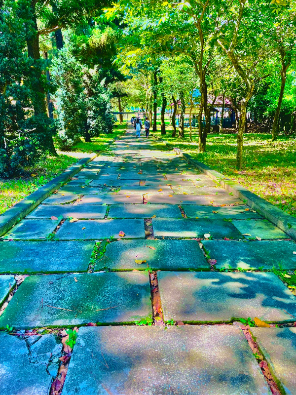

Hôm nay là ngày đầu tiên trong kỳ nghỉ của tôi. Tôi có dịp về một nơi cách xa thành phố. Từ đây tôi bắt đầu có lại những cảm giác từ quá...

<!--truncate-->

---

Hôm nay là ngày đầu tiên trong kỳ nghỉ của tôi. Tôi có dịp về một nơi cách xa thành phố. Từ đây tôi bắt đầu có lại những cảm giác từ quá khứ và bắt đầu quý trọng những giây phút yên bình này.

Tôi đi dạo trên 1 con đường với nhiều bóng râm xung quanh. Bạn có thể hình dung ra chứ, vâng oxygen đang dồi dào trong không khí cùng với lượng nước của trình thoát hơi từ lá cây, tất cả chúng tạo nên 1 cảm giác thật sảng khoái. Dừng chân tại 1 chiếc ghế đá, tôi chậm rãi ngồi xuống và tận hưởng. Humm… không một âm thanh từ chốn xô bồ, không một tiếng còi xe, thay vào đó chỉ có tiếng xào xạc của lá cây cùng với những chú chim hót. Lần đầu tiên sau 1 khoảng thời gian dài làm việc, học tập vất vả, tôi lại nhớ về những mảng ký ức ngày xưa - thời còn nhỏ (dù tôi chẳng muốn nhớ về nó tý nào). Đó là khoảng thời gian tôi được sống đúng với “tự do” của một đứa trẻ. Tôi được làm, được học bất kì thứ gì tôi muốn miễn nó làm tôi hạnh phúc và không hại đến ai. “Trước giông bão thường là sự yên bình”, sau những tháng ngày đó tôi phải quay lại với việc học, những thứ làm tôi thấy chán nản.

Trong khoảng thời gian phát triển bản thân, tôi luôn tìm kiếm những cảm giác khiến mình trở nên hạnh phúc mỗi khi gặp phải áp lực (gần đây tôi biết nó được gọi là healing - chữa lành). Đó chắc chắn không phải cảm giác từ sự tự do vì tôi chưa có được nó, còn khá xa. Tôi đã từng nghĩ rằng mình không thích thiên nhiên (khoảng thời gian khi còn là một Hikikomori). Tuy nhiên lần này tôi đã vấp phải sai lầm (tôi thiếu mindset Double-Check). Tôi đã quên đi cảm giác đặc biệt mà chỉ thiên nhiên mang tới, một liều thuốc chữa lành tôi. Đây chính là những hạnh phúc mà tôi đã tìm kiếm bất lâu nay. Chỉ cần ngồi đấy và nhìn vào hư vô, với tôi đã quá hạnh phúc rồi!

