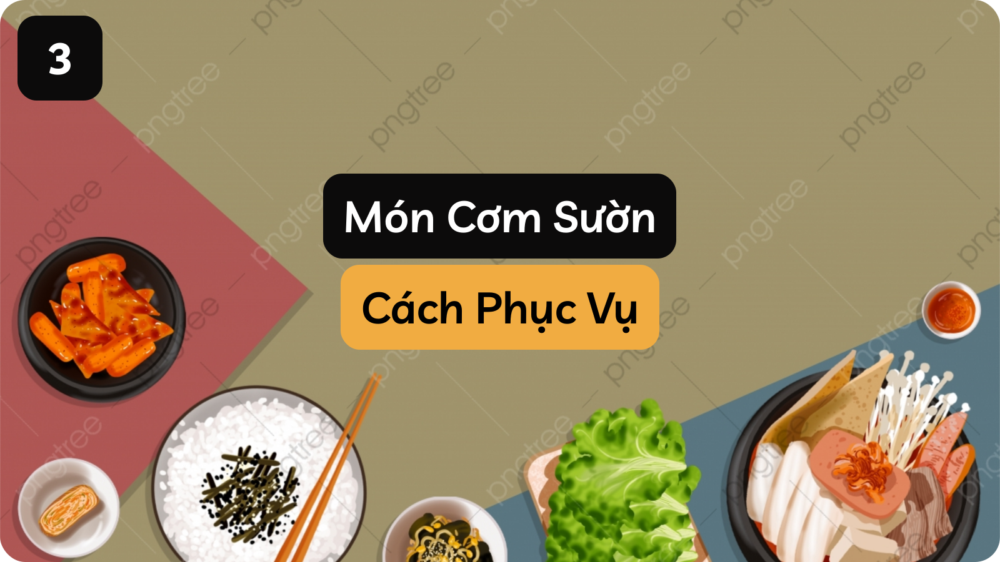
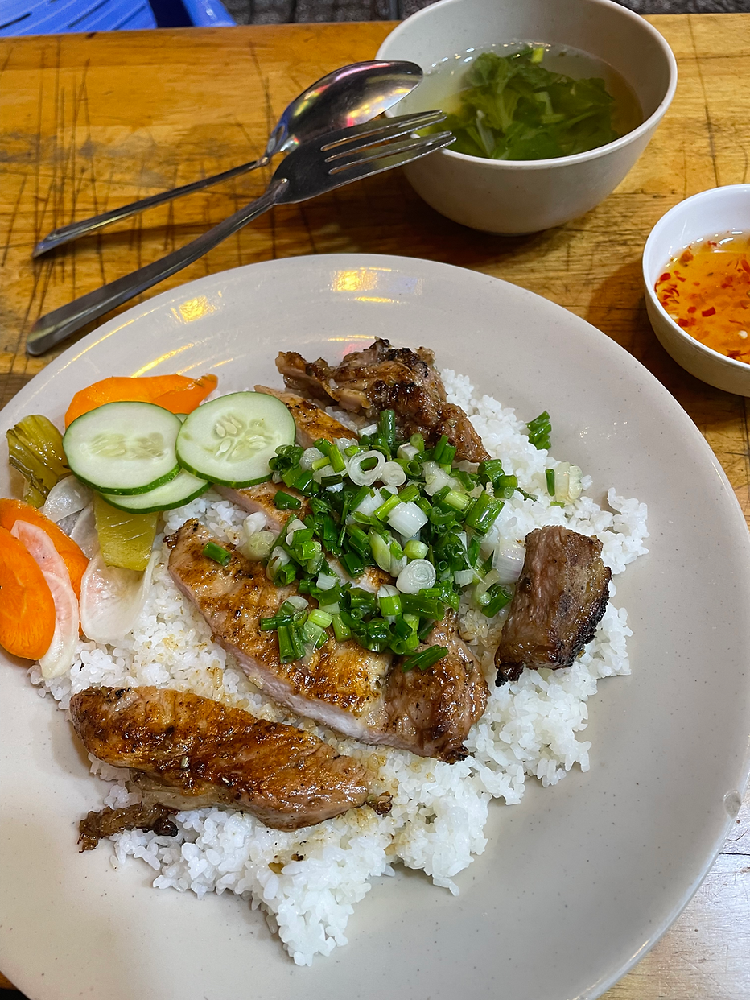

“Cô ơi cho con 1 đĩa cơm sườn full topping!” là lời suy nghĩ trong lòng của tôi, nhưng ai lại làm thế! “Cô ơi cho con 1 đĩa cơm chỉ sườn...
<!--truncate-->

---

“Cô ơi cho con 1 đĩa cơm sườn full topping!” là lời suy nghĩ trong lòng của tôi, nhưng ai lại làm thế!

“Cô ơi cho con 1 đĩa cơm chỉ sườn thôi ạ!”

“Như cũ phải không con?”, cô nói. (như cũ là tôi không dùng đồ chua, rau, dưa, cà,…)

“Dạ vâng ạ!”, tôi đáp.

Tôi ngồi vào chiếc bàn mà tôi vẫn luôn ngồi trước kia, setup mọi thứ thật hoàn hảo để thưởng thức. Trong lúc chuẩn bị tôi vô tình nghe được giọng từ cô:

“Lấy nước mắm với canh ra trước rồi mới đem cơm ra con kia!”.

Nếu nghe lần đầu chắc ai cũng suy nghĩ được phần nào tính cách của cô, nhưng đây chỉ là lời nói vui vẻ cô nói với người em gái mình. Bầu không khí vẫn vui vẻ. Tôi lấy làm lạ về câu nói lúc nãy. Nhưng thôi, tôi hì hục ăn đĩa cơm trước đã, bản thân là trên hết.

Ăn xong cũng đúng lúc quán bớt người. Tôi đi đến chỗ cô, tính tiền và không quên hỏi cô:

“Cô ơi sao phải đem nước mắm với canh ra trước, sau đó mới mang cơm ra vậy cô?”.

“Mình phải chuẩn bị dụng cụ cho ta đầy đủ hết rồi mới mang món ra con! Chứ không thì khi mình mang ra rồi nhưng vẫn chưa có các vật kèm theo thì với người khó tính người ta dễ cáu lắm con! Hoặc là người ta đang đói, thấy đồ ăn trước mắt nhưng vẫn chưa ăn được thì phần lớn sẽ rất giận cho xem con! Làm gì mình cũng phải đặt cái tâm lên trước rồi mới đến các vấn đề khác!”, cô vui vẻ trả lời.

“Dạ vâng ạ, con cảm ơn cô nhiều ạ! Con chào cô ạ!”, tôi trả lời cô.

Sau khi về nhà tôi tìm hiểu thêm thì mới để ý rằng, đây là những quy tắc phục vụ cơ bản nhất của những người nhân viên trong nhà hàng. Đây là lần đầu tôi thấy nó ở một quán cơm bình dân. Những điều này tuy vẫn khá nhỏ nhặt trong cuộc đời tuy nhiên chỉ cần tích góp hằng ngày thì cuộc sống sẽ ngày càng ý nghĩa hơn. Sau khi ra xe về, tôi chỉ muốn thốt lên rằng:

“MỘT CUỘC ĐỜI THẬT ĐÁNG SỐNG!”

